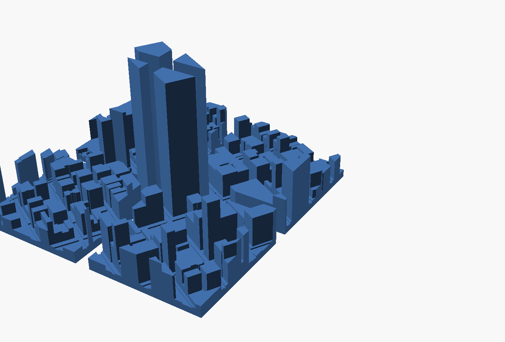
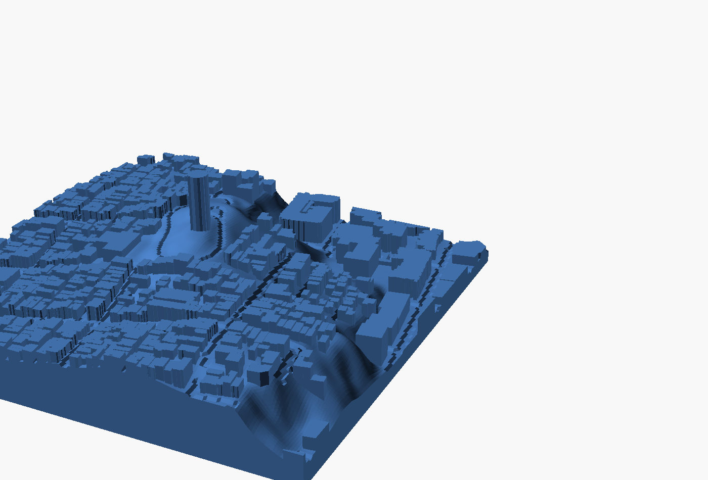
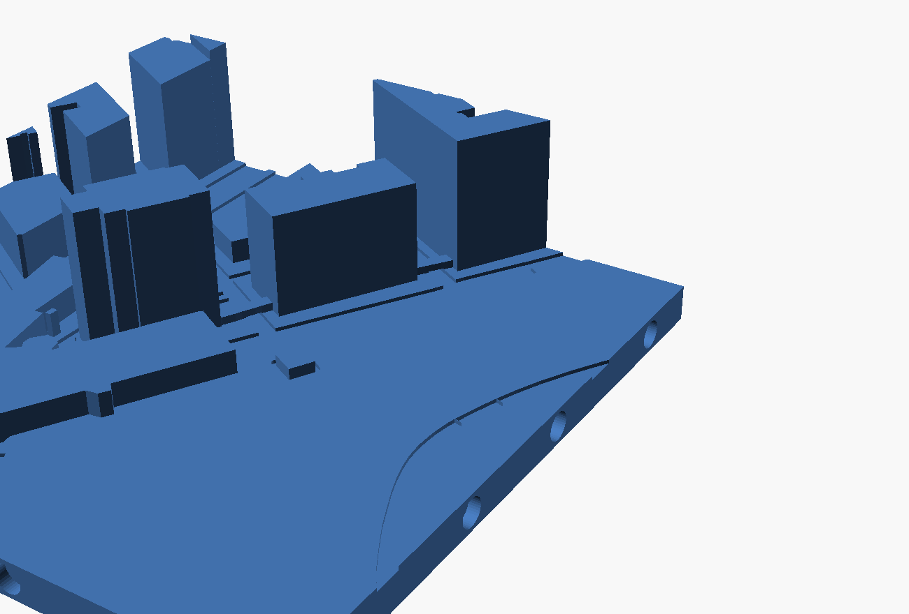
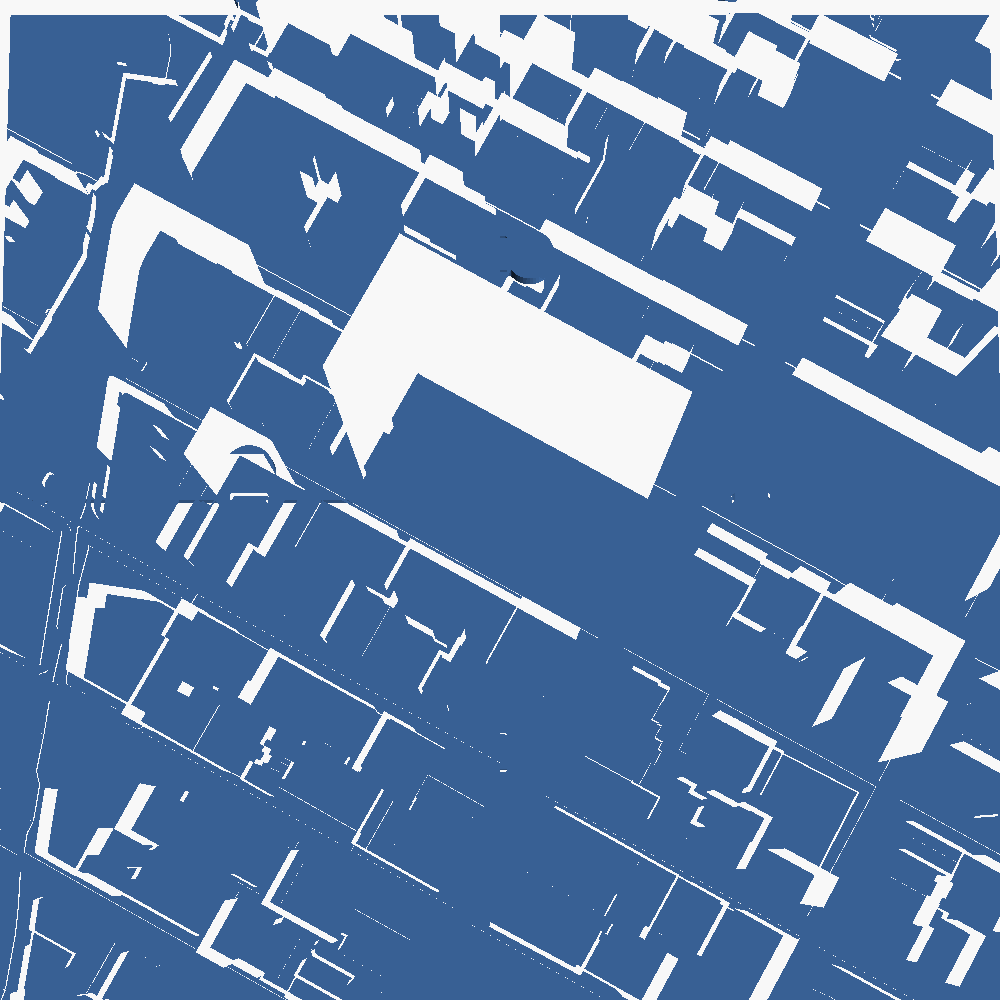

# tilemaker — OSM + DEM → snap-fit 3D-printed map tiles

Live Overpass and elevation data in, print-ready watertight 3MF/STL out.
Every figure below is measured, not estimated.

| | |
|---|---|
|  |  |
| Midtown Manhattan, flat, 1:4167 | San Francisco, terrain fused, 88 m relief |
|  |  |
| NYC Marathon finish, route ridge, 1:2240 | Jigsaw tabs (strips only — see below) |

## Install

```bash
python3 -m venv .venv
.venv/bin/pip install -r requirements.txt
```

## Use

```bash
# flat city, 3x3 @ 60mm, captive magnets
.venv/bin/python -m tilemaker --center 40.7484,-73.9857 --grid 3x3 \
    --joint magnet --magnet-mode embed

# with terrain
.venv/bin/python -m tilemaker --center 37.8024,-122.4058 --grid 2x2 --terrain \
    --joint magnet --magnet-mode embed --out out_sf

.venv/bin/python check.py out/*.stl                    # print-readiness audit
openscad -o out/preview.png out/assembly.scad          # assembled render
```

| set | scale | tiles | result |
|---|---|---|---|
| Midtown Manhattan 3x3, flat | 1:4167 | 9 | 641 buildings, 344 cm³, ~427 g PLA |
| San Francisco 2x2, terrain | 1:4167 | 4 | 669 buildings, 88 m relief → 21 mm, 212 cm³ |

All 13 tiles watertight, one solid + eight enclosed magnet cavities, every edge
exactly two faces. ~0.1 s per flat tile, ~0.6 s with terrain.

## Pipeline

1. **Extract** — Overpass for footprints and roads (`osm.py`); Terrarium RGB
   elevation tiles from AWS open data, keyless, ~3.8 m/px at z15 (`dem.py`).
2. **Mesh** — shapely for 2D ops, manifold3d for CSG (`geometry.py`, `build.py`).
   No Blender: this is polygon offsetting and boolean CSG, and bpy is a heavy
   version-pinned dependency for it.
3. **Joints** — magnet pockets or jigsaw tabs (`joints.py`).
4. **Export** — 3MF project with plate layout, attribution, and the magnet
   pause; STL alongside (`threemf.py`).

## Corrections to the strategy doc

**"Pre-sliced STL files."** Slicing emits printer-specific G-code, which is not
what you sell. Ship 3MF *projects*. This is measured, not stylistic: all 9
Manhattan tiles are watertight in the 3MF; one of them degrades to non-manifold
in STL, because STL stores float32 and two distinct vertices quantize onto each
other. Same geometry, same run.

**Dovetails do not assemble on a grid.** A tab wider than its neck enters only
by sliding along the seam. On a 1xN strip, fine. On an NxM grid the last tile
must slide two perpendicular directions at once, and rigid PLA will not. Every
shipping modular terrain line uses magnets or separate under-clips for exactly
this reason. `--joint magnet` is the default; `--joint jigsaw` is implemented
and correct, for strips and borders.

**Magnet polarity decides whether the kit works.** N-out on E/N edges, S-out on
W/S. Pockets are mirror-symmetric about each edge midpoint, so a tile still
mates rotated 180°. Get it wrong and half your seams repel.

**`--magnet-mode embed`** buries the pocket (floor 0.8 mm, capped at 2.95 mm)
and writes a pause into the 3MF, so the magnet is captive and invisible with no
glue. The pause is not in the 3MF spec — each slicer keeps custom G-code in its
own metadata file — so both vendor forms go in the same container:
`Metadata/custom_gcode_per_layer.xml` (Bambu) and
`Metadata/Prusa_Slicer_custom_gcode_per_print_z.xml` (Prusa, `M601`).
`--magnet-mode glue` leaves the pocket open at the bed instead.

**SRTM is too coarse for city tiles.** 30 m postings across a 250 m tile is
eight samples. Terrarium at z15 is ~3.8 m/px, keyless and global. Raw bilinear
still facets on steep faces because the source postings are coarser than our
sample spacing — `--dem-smooth` (default 1.0 px) removes that without touching
real relief.

**OSM height coverage is local, not global.** Midtown Manhattan is 93% tagged.
Most of the world is far below that; `osm.guess_height` falls back to
`building:levels`, then a per-type storey count. Check coverage before you
promise a city.

**ODbL is fine for this business.** A 3D model derived from OSM is a Produced
Work: share-alike does not reach your STLs, attribution does. Credit
"© OpenStreetMap contributors" on the product, the listing, and in the package.
`ATTRIBUTION.txt` ships inside every 3MF.

## Geometry problems this hits, and the fixes

- **Shared walls → non-manifold edges.** OSM row buildings touch exactly
  corner-to-corner; the union then emits edges with 4 incident faces. Fixed by
  dilating each footprint a deterministic 0.02–0.06 mm, far under nozzle
  resolution, so every kiss becomes a resolvable overlap. 3–5 bad edges per
  tile → 0.
- **Needle footprints.** A footprint sliced by the tile edge can survive with
  nonzero area and zero printable width, extruding to a zero-volume sheet.
  Rejected by the real criterion: `buffer(-min_wall/2)` must be non-empty.
- **Degenerate spikes.** Where two footprints meet at exactly one point the
  union leaves a 4-face zero-volume shell on a single vertex. Dropped as a
  whole component — stripping degenerate *faces* in place opens holes in tiles
  that were already closed.
- **Overpass 504s.** `relation[building]` with `out geom` expands multipolygon
  members server-side and times out past a couple hundred metres square, so
  it is opt-in (`--relations`) and falls back to ways-only rather than failing
  a run. Cost: courtyard multipolygon buildings are skipped.
- **Tower height.** Empire State at 1:4167 is 91 mm and dominates a set.
  `--max-bld-h` clips it (default 70 mm); `--vscale` exaggerates flat cities.

## The three product pillars

### 1. Snap-fit interlocking — built, after fixing two real bugs

Magnet pockets were cut with a **vertical** axis, so neighbouring tiles coupled
side-lobe to side-lobe. Measured with `magnetics.py` (Gilbert charge model,
converged by n=14):

| joint | force per seam |
|---|---|
| vertical pocket, 3.6 mm inset (original) | 0.55 N |
| horizontal, embedded behind 0.8 mm wall | 3.52 N |
| horizontal, flush at the seam (glue) | 11.06 N |

A 44 g tile weighs 0.43 N, so the original joint barely held its own weight.
Second bug: the pocket transform sent the axis to world Y instead of the edge
normal — pockets were being cut *along* the seam rather than into it. Both
fixed and verified on all four edges.

Polarity alternates along each edge and the edge families are complementary
(E/N: +along is N-out; W/S: +along is S-out), which is verified to make seams
attract and to survive a 180° rotation. 90° cannot work for any polarised
scheme, so tiles are keyed to two orientations. `MAGNETS.md` is emitted per set
as an insertion guide.

### 2. Low-poly — built, but it does not do what the pitch claims

`stylize.py` simplifies at nozzle scale, quantises heights, and merges touching
footprints that land on the same height step. Footprint vertices drop 36% at
city scale and 67% at route scale (1338 → 881 solids). Triangles on one tile:
4828 → 4032.

**It does not make prints faster.** Volume is unchanged (45.4 → 45.8 cm³), and
print time follows volume and height, not triangle count. It is an aesthetic
and slicing-robustness win. Do not sell it as speed.

**Support-free is real, and it was already true.** My overhang metric was
inverted — `arccos(-nz)` is 90° for a *vertical wall*, not an overhang, so the
early "1% overhang" figures were measuring the safe faces. Corrected in
`check.py`. Actual numbers, area needing support:

| geometry | needs support |
|---|---|
| buildings + roads, no joints | **0.0 mm²** |
| plus horizontal magnet pockets | 69.7 mm² (0.32%) |
| plus teardrop pockets | 67.1 mm² (0.30%) |

Extruded footprints with flat tops cannot overhang, so the map itself is
support-free by construction. Only the pockets need anything, and a 5.2 mm
hole is bridged routinely. The teardrop pocket buys almost nothing for 2.2 mm
of extra base height — implemented, but not recommended.

### 3. Personal-story route kits — built

`route.py` takes a GPX track (`--route-gpx`) or inline waypoints (`--route`),
fits the grid to the route rather than the reverse, and raises the route as a
ridge on the tiles. Verified on a 2.84 km GPX: the ridge is solid at 31 of 31
sampled route points in its height band.

**Honest gap:** a 2.84 km route auto-fits to 1:18,158, and at that scale a
1.2 mm ridge competes with dense buildings instead of being the hero. To make
this a giftable product the route needs to dominate — a wider ridge, buildings
suppressed near it, or a two-colour print with a filament change at the ridge
layer. Not done.

## Printing it on an Ender 3 V3 SE

```bash
# 1. always print this first -- 13 g a side, validates the joint
python -m tilemaker --center 0,0 --coupon --printer ender3v3se --magnet-mode glue

# 2. then a real set
python -m tilemaker --center 40.7484,-73.9857 --grid 2x2 \
    --printer ender3v3se --magnet-mode glue --lowpoly
python check.py --printer=ender3v3se out/*.stl
```

Two things had to change for this printer, and both were real blockers:

- **Bed size.** The plate layout was hardcoded to 256x256. On the Ender's
  220x220 it placed tiles out to x=222 — two millimetres off the bed. Bed
  sizes now come from a `--printer` preset.
- **Pause dialect.** The embedded-magnet pause was written as `M601`, which is
  Prusa firmware. Every Creality Ender is Marlin and uses `M600`; sent M601 it
  does nothing, runs straight over the magnet layer and seals the pockets shut.
  Worse, no slicer reads a pause out of a 3MF for Marlin at all. So on a Marlin
  preset the tool now ships `PAUSE_README.txt` with the manual steps and says
  so on stdout, rather than pretending the pause is in the file.

**Use `--magnet-mode glue` on this printer.** The pockets open at the seam
face, no pause is needed, and the joint is *stronger* — magnet faces touch
across the seam at 11.1 N per seam against 3.5 N embedded. Glue them in after
printing, poles per `MAGNETS.md`.

Settings: 0.4 mm nozzle, 0.2 mm layers, PLA. The map geometry needs no
supports at all; the magnet pockets are 0.3% of surface and a 5.2 mm hole
bridges fine, so leave supports off and check the first pocket. Print one or
two tiles at a time — nine tall tiles on one plate means one failure costs the
whole set.

## Known limits

- Terrain mode leaves ~1% of surface as unsupported overhang (road-channel
  floors and building undersides on slopes). Printable, but budget supports or
  raise `--road-depth` toward 0.
- No water or park polygons, no per-tile edge labels, no multi-material inlay.
- Plate layout assumes a 256×256 bed (`threemf.PLATE`); edit for a 250×210 Prusa.
